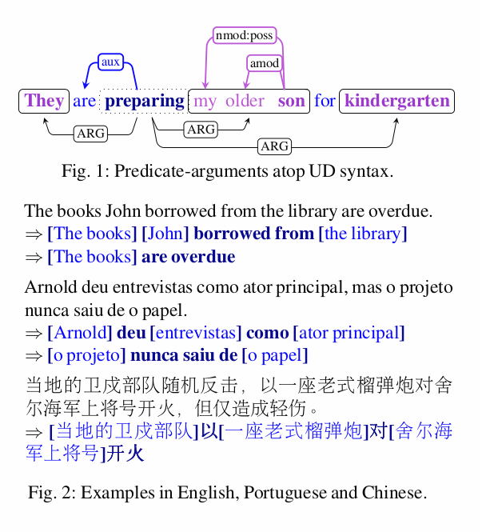

Introduction and Motivation
===========================

The Stanford Dependencies have become a widely adopted syntactic representation,
lately forming the basis of the
[Universal Dependencies (UD) project](http://universaldependencies.org), an
international effort to convert and create syntactic treebanks into a single
standard form ([de Marneffe et al., 2014](references.md); [Nivre et al., 2016](references.md)). This deep
syntactic representation has become the backbone of a variety of downstream
efforts in information extraction and computational semantics.

The initial Stanford effort ([de Marneffe et al., 2006](references.md)) consisted of a
clearly stated target representation, along with a transformation process over
Penn Treebank style constituency trees: this process was language specific and
not implemented in a way that lent to easy modification by others.

> "The method is general, but requires appropriate rules for each language and
> treebank representation." ([de Marneffe et al., 2006](references.md))

We embrace and extend this highly successful approach, as an effort to enhance
the UD effort with semantic annotations, and to have a cross-lingual information
extraction framework that transparently improves in quality as a result of the
community’s continued progress in UD parsing. Our predicate-argument extraction
framework, PredPatt, is based on extensible, interpretable, language-neutral
extraction patterns. Improving on the strategy of the Stanford conversion
process, we pay special care that our framework can be easily understood and
modified by others: this is meant to improve scientific replicability and to
enable the framework to evolve in sync with future developments in UD.

PredPatt’s goal is to identify the structure of predicates and
arguments—leaving further analysis to systems pursuing competing
theories.[*] The rules are non-lexicalized, relying on the
“universality” of the UD syntax, which means the framework applies
directly to all UD-supported languages, and to syntactic parses either
manually constructed (as part of enhancing treebanks) or automatically
derived (as part of semantic parsing or information extraction). We
consider these cases through evaluation of output based on automatically
generated parses in English, and on gold treebanks in Chinese, English,
Hebrew, Hindi, and Spanish.

[*]: E.g., PropBank ([Palmer et al., 2005](references.md)), semantic proto-roles ([Reisinger et al., 2015](references.md)),
   unsupervised approaches ([Poon & Domingoes, 2009](references.md)), interpretation as "OpenIE" tuples.
